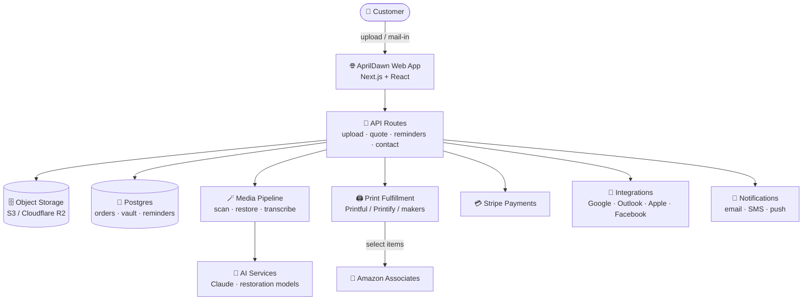

<div align="center">

# 🌅 AprilDawn

### _The everything store for memories._

**Why lose your reveries forever when you can keep them — beautifully, permanently — for the rest of your life?**

Upload a photo, or mail us the whole shoebox. AprilDawn **digitizes**, **restores**, and **reimagines** your photos, film, and video — then prints them on _literally anything_, builds living LED memory walls, mails talking greeting cards, and never lets you miss a birthday again.

<br/>


🖼️ Digitize · ✨ Restore · 👕 Print on anything · 🎨 Hand-painted masterpieces · 🧱 The Living Wall · 💌 Memory Mail · 🎂 Occasions & auto-gifting

</div>

---

## 📑 Table of contents

- [✨ What is AprilDawn?](#-what-is-aprildawn)
- [🎯 The vision](#-the-vision)
- [🧰 What we make (full feature catalog)](#-what-we-make-full-feature-catalog)
  - [📦 Digitize Everything](#-digitize-everything)
  - [✨ Restore & Remaster](#-restore--remaster)
  - [🖼️ Print on Anything](#️-print-on-anything)
  - [🎨 Hand-Painted Masterpieces](#-hand-painted-masterpieces)
  - [🧱 The Living Wall](#-the-living-wall-flagship)
  - [💌 Memory Mail](#-memory-mail-flagship)
  - [🎂 Occasions & Auto-Gifting](#-occasions--auto-gifting-flagship)
- [🛍️ Print-on-anything catalog](#️-print-on-anything-catalog)
- [💰 How AprilDawn makes money](#-how-aprildawn-makes-money)
- [🏗️ Tech stack](#️-tech-stack)
- [🗺️ Architecture at a glance](#️-architecture-at-a-glance)
- [📂 Project structure](#-project-structure)
- [🚀 Getting started (local)](#-getting-started-local)
  - [💻 Bash / terminal](#-bash--terminal)
  - [🖥️ GitHub Desktop](#️-github-desktop)
  - [🧩 Visual Studio Code](#-visual-studio-code)
- [⚙️ Available scripts](#️-available-scripts)
- [🔑 Environment variables](#-environment-variables)
- [🔌 Integrations](#-integrations)
- [☁️ Deployment](#️-deployment)
- [🛣️ Roadmap & pending features](#️-roadmap--pending-features)
- [🔮 Moonshots (the wild future)](#-moonshots-the-wild-future)
- [📚 Deep-dive docs](#-deep-dive-docs)
- [🤝 Contributing](#-contributing)
- [⚖️ Legal & disclosures](#️-legal--disclosures)
- [📜 License](#-license)

---

## ✨ What is AprilDawn?

AprilDawn is a **memory-preservation super-app and storefront**. People bring us their most precious moments in _any_ form — a phone photo, an attic full of slides, a box of VHS tapes, Grandpa's voicemails — and we turn them into things they can hold, wear, hang, gift, and keep forever.

It is three businesses fused into one warm, delightful brand:

| 🧩 Pillar | What it means |
| :-- | :-- |
| 🛟 **Rescue** | Digitize & transcribe any media format ever made. Restore & remaster what time has damaged. |
| 🎁 **Reimagine** | Print a single memory on _literally anything_ — apparel, walls, cakes, vinyl — or commission a hand-painted masterpiece. |
| ♾️ **Remember** | The Living Wall, talking Memory Mail cards, lifetime cloud vault, and automatic occasion gifting keep memories alive and growing. |

> 💡 **The north star:** _no memory is ever lost again — and remembering should feel wonderful._

---

## 🎯 The vision

AprilDawn began with a shoebox in an attic and a simple, aching question: **why do we let our most precious moments fade in drawers and on dying tapes?**

So we built the everything store for memories. One photo can become a t-shirt, a colorized canvas, a talking card, a hand-painted portrait over the mantel, a tile on a glowing wall, or a face on every hoodie at Grandma's 90th. Send us one thing or a lifetime of things — we take it from there, with free proofs and a 100% happiness guarantee, and your originals always come home.

---

## 🧰 What we make (full feature catalog)

### 📦 Digitize Everything
> _Upload it — or mail us the shoebox._

Photos, slides, negatives, film reels, VHS, camcorder tapes, cassettes, vinyl, and voicemails — transcribed into pristine, archival-grade digital files you own forever.

| 🎞️ Format | ✅ Supported |
| :-- | :-- |
| Prints, Polaroids, panoramas | ✔️ |
| 35mm / 110 negatives, mounted slides | ✔️ |
| 8mm · Super 8 · 16mm film reels | ✔️ |
| VHS · VHS-C · MiniDV · Hi8 · Betamax | ✔️ |
| Audio cassettes · microcassettes · reel-to-reel | ✔️ |
| Vinyl records · voicemails · glass plate negatives | ✔️ |

- 🖱️ **Drag-and-drop upload** _or_ a prepaid, trackable **MemoryBox** mail-in kit
- 🔍 Up to **4K / 48-bit** scans for prints; web-optimized copies for sharing
- 🗣️ **Audio & video transcription** with searchable transcripts and captions
- 📦 Everything returned to you — **originals never thrown away**
- 🗂️ Auto date- and face-organized albums

### ✨ Restore & Remaster
> _Bring faded, torn, and forgotten photos back to life._

- 🩹 Tear, crease, mold, and water-damage repair
- 🎨 Historically-faithful **colorization** of black-and-white photos
- 🔬 **Up-res & remaster** blurry photos and low-res video to crisp HD/4K
- 🫶 Optional **"Living Portrait"** subtle motion — a smile, a blink, a breath (clearly labeled & consent-gated)
- 👀 You approve every proof before anything is finalized

### 🖼️ Print on Anything
> _If it has a surface, your memory belongs on it._

T-shirts and sweaters are just the **start**. See the [full catalog](#️-print-on-anything-catalog) below — including edible cake prints, custom vinyl, skateboards, and pet bandanas.

### 🎨 Hand-Painted Masterpieces
> _A wall-sized family portrait that looks hand-painted._

- 🖌️ Choose a style: oil, watercolor, pencil, pop-art, Renaissance, and more
- 📐 Up to **wall-sized (100"+)** on gallery canvas or fine-art paper
- 🧑‍🎨 Digital render → giclée with real brushwork → **fully hand-painted by a commissioned artist**
- 👨‍👩‍👧‍👦 **Merge people** from different photos and eras into one timeless portrait

### 🧱 The Living Wall _(flagship)_
> _A 100-photo collage that also glows and remembers._

- 🖼️ A giant printed **mosaic** (100+ photos) custom-laid for your exact wall
- 💡 A slim **embedded LED frame** cycles through every photo _and_ video
- 📲 Add photos from your phone — **the wall updates itself by dessert**
- 🏠 Looks like a hung portrait; mounts flush and disappears into the decor
- 🧤 White-glove design & installation available

### 💌 Memory Mail _(flagship)_
> _The greeting card, reborn — now it talks back._

- 📮 Custom photo **cards & lay-flat photobooks**, professionally printed and mailed
- 🎙️ Embedded **audio/video** via **QR scan**, **NFC tap**, and **AR playback**
- 📱 Record a message right from your phone — we press it into the card
- 🗓️ Schedule sends for birthdays, holidays, and "just because"

### 🎂 Occasions & Auto-Gifting _(flagship)_
> _Never miss a birthday — and troll Grandma with 1000% love._

- 🔗 Sync birthdays from **Google, Outlook, Apple, and Facebook**
- ⏰ Smart reminders by **email, SMS, and push** — with lead time to ship
- 👆 **One-tap gifting** from your AprilDawn vault of photos
- 👵 The legendary **"Troll Grandma" bundle**: her face on every shirt, mug, cake, vinyl, pillow, and pair of socks at the party — _maximum love, maximum chaos_

---

## 🛍️ Print-on-anything catalog

> 🟢 = first-party studio printing · 🛒 = fulfilled via maker network / Amazon Associates

| Category | Products |
| :-- | :-- |
| 👕 **Apparel** | T-shirts 🟢 · Hoodies 🟢 · Crew sweatshirts 🟢 · Face socks 🟢 · Family pajamas 🟢 |
| 🖼️ **Wall Art** | Gallery canvas 🟢 · Framed prints 🟢 · Metal prints 🟢 · Acrylic prints 🟢 · Tapestries 🟢 |
| 🛋️ **Home** | Photo blankets 🟢 · Throw pillows 🟢 · Jigsaw puzzles 🟢 · Ornaments 🟢 · Photo candles 🛒 |
| ☕ **Drinkware** | Photo mugs 🟢 · Insulated tumblers 🛒 · Stemless wine cups 🛒 |
| 🎒 **Accessories** | Phone cases 🟢 · Tote bags 🟢 · Keychains 🟢 · Fridge magnets 🟢 |
| 🎁 **Everything Else** | 🎂 Edible cake prints · 🎵 Custom vinyl records · 🛹 Skate decks · 🚩 Garden flags 🛒 · 🐾 Pet bandanas 🛒 · Photo wrapping paper 🛒 |

> 🤔 **Don't see it? Ask anyway.** If it has a surface, we'll find a way to put your memory on it.

---

## 💰 How AprilDawn makes money

```
   Per-project sales        Subscriptions            Affiliate & partners
   ──────────────────       ─────────────────        ──────────────────────
   • Digitizing / scan      • Family Vault $9/mo      • Amazon Associates 🛒
   • Restoration            • Legacy / Estate         • Maker-network markup
   • Print on anything      • Auto-gifting credits    • White-glove installs
   • Living Wall installs   • Card subscription runs  • Gift-bundle upsells
```

- 💵 **À la carte**: digitizing from `$0.39/scan`, restoration from `$19`, prints from `$12`.
- 🔁 **Family Vault** (`$9/mo`): lifetime cloud vault, 20% off everything, auto-gifting, priority turnaround.
- 🏛️ **Legacy / Estate**: bulk digitizing, dedicated archivist, white-glove Living Wall installs.
- 🛒 **Amazon Associates**: select products link out with our affiliate tag (`NEXT_PUBLIC_AMAZON_ASSOCIATES_TAG`) — _"As an Amazon Associate, AprilDawn earns from qualifying purchases."_ (disclosed site-wide).

See [`docs/BUSINESS-PLAN.md`](docs/BUSINESS-PLAN.md) for unit economics and go-to-market.

---

## 🏗️ Tech stack

| Layer | Choice | Why |
| :-- | :-- | :-- |
| ⚛️ Framework | **Next.js 16 (App Router)** + **React 19** | SSR/SSG for SEO-heavy marketing + commerce, API routes for backend |
| 🧮 Language | **TypeScript** (strict) | Safety across a large product surface |
| 🎨 Styling | **Tailwind CSS v4** | Custom "April Dawn" sunrise design system in `globals.css` |
| ✍️ Type/Fonts | **Fraunces** (display) + **Geist** (sans/mono) | Editorial, nostalgic, premium |
| 🧱 UI | Hand-built component library (`src/components/ui`) | No heavy deps; fully owned |
| 🔌 API | Next Route Handlers (`src/app/api/*`) | Upload intake, quotes, reminders, contact |
| 🚀 Deploy | Vercel-ready (any Node host works) | Zero-config Next.js hosting |

> 🤖 AI-assisted features (restoration, captions, gift suggestions) default to the latest, most capable **Claude** models via `ANTHROPIC_MODEL` — see `.env.example`.

---

## 🗺️ Architecture at a glance



Full design lives in [`docs/ARCHITECTURE.md`](docs/ARCHITECTURE.md).

---

## 📂 Project structure

```
AprilDawn/
├─ src/
│  ├─ app/                      # App Router pages & API routes
│  │  ├─ page.tsx               # 🏠 Home
│  │  ├─ services/              #    Services index + [slug] detail
│  │  ├─ living-wall/           # 🧱 Flagship: The Living Wall
│  │  ├─ memory-mail/           # 💌 Flagship: Memory Mail
│  │  ├─ occasions/             # 🎂 Flagship: reminders + auto-gifting
│  │  ├─ how-it-works/ pricing/ shop/ about/ faq/ contact/ upload/
│  │  ├─ legal/                 # ⚖️ privacy · terms · content & rights
│  │  ├─ api/                   # 🔌 upload · quote · reminders · contact
│  │  ├─ sitemap.ts robots.ts   # 🔍 SEO
│  │  └─ globals.css            # 🎨 "April Dawn" design tokens
│  ├─ components/
│  │  ├─ ui/                    # Button · Container · Section · Badge
│  │  ├─ site/                  # Header · Footer · Logo
│  │  ├─ cards/                 # ServiceCard · ProductCard
│  │  ├─ upload/ occasions/ contact/ legal/
│  └─ lib/                      # 🧠 site · services · products · occasions · utils
├─ docs/                        # 📚 vision · business · architecture · roadmap · …
├─ public/                      # static assets
├─ .env.example                 # 🔑 all the keys you'll wire up
└─ README.md                    # 👈 you are here
```

---

## 🚀 Getting started (local)

> ✅ Requires **Node.js 20+** and **npm**. You already connected GitHub Desktop and VS Code — here's how to open AprilDawn in each.

### 💻 Bash / terminal

```bash
# 1) Clone your repo (or pull the branch if already cloned)
git clone https://github.com/showoffjp/aprildawn.git
cd aprildawn

# 2) Get the branch with the website
git fetch origin
git checkout claude/hopeful-heisenberg-9pefyc

# 3) Install dependencies
npm install

# 4) (optional) set up env vars
cp .env.example .env.local   # then fill in keys as needed

# 5) Run the dev server
npm run dev
#  ▲ Next.js dev server → http://localhost:3000
```

Open **http://localhost:3000** in your browser. Edit any file in `src/` and the page hot-reloads instantly. 🔥

### 🖥️ GitHub Desktop

1. **File → Clone repository → showoffjp/aprildawn** (or **Fetch origin** if already cloned).
2. In the **Current Branch** dropdown, choose **`claude/hopeful-heisenberg-9pefyc`**.
3. Click **"Open in Visual Studio Code"** (top-right), or **Repository → Open in Terminal** to run `npm install && npm run dev`.

### 🧩 Visual Studio Code

1. **File → Open Folder…** → select the `aprildawn` folder.
2. Open the integrated terminal (`` Ctrl+` ``) and run:
   ```bash
   npm install
   npm run dev
   ```
3. `Ctrl/Cmd + Click` the **http://localhost:3000** link to open it.
4. 💡 Recommended extensions: **Tailwind CSS IntelliSense**, **ESLint**, **Prettier**.

---

## ⚙️ Available scripts

| Command | What it does |
| :-- | :-- |
| `npm run dev` | ▶️ Start the local dev server with hot reload |
| `npm run build` | 📦 Production build (static + server) |
| `npm run start` | 🌍 Serve the production build |
| `npm run lint` | 🧹 Lint with ESLint |
| `npm run typecheck` | 🔎 Type-check with `tsc --noEmit` |

---

## 🔑 Environment variables

Copy `.env.example` → `.env.local` and fill in what you use. Highlights:

| Key | Purpose |
| :-- | :-- |
| `NEXT_PUBLIC_SITE_URL` | Canonical URL for metadata, sitemap, OG tags |
| `NEXT_PUBLIC_AMAZON_ASSOCIATES_TAG` | 🛒 Your Amazon affiliate tag injected into outbound links |
| `S3_*` | 🗄️ Object storage for uploads (S3 / Cloudflare R2) |
| `STRIPE_*` | 💳 Payments |
| `PRINTFUL_API_KEY` / `PRINTIFY_API_KEY` / `GOOTEN_API_KEY` | 🖨️ Print-on-demand fulfillment |
| `ANTHROPIC_API_KEY` / `ANTHROPIC_MODEL` | 🤖 AI-assisted restoration, captions, gift ideas |
| `GOOGLE_* / MICROSOFT_* / FACEBOOK_*` | 📅 Occasion integrations (OAuth) |
| `RESEND_API_KEY` / `TWILIO_*` | 📨 Email & SMS notifications |
| `AUTH_SECRET` / `DATABASE_URL` | 🔐 Auth & database |

> 🔒 Never commit real secrets. `.env*` is gitignored.

---

## 🔌 Integrations

| Service | Used for | Status |
| :-- | :-- | :-- |
| 📧 **Google** (Gmail/Calendar/Contacts) | Import birthdays, send reminders | 🟡 Planned |
| 📨 **Microsoft 365 / Outlook** | Calendar birthdays & anniversaries | 🟡 Planned |
| 🍎 **Apple Contacts** | Saved birthdays from iPhone | 🟡 Planned |
| 👍 **Facebook** | Friends' birthdays, tap-to-gift | 🟡 Planned |
| 🛒 **Amazon Associates** | Affiliate revenue on select products | 🟢 Wired (link builder) |
| 💳 **Stripe** | Checkout & subscriptions | 🟡 Planned |
| 🖨️ **Printful / Printify / Gooten** | Print fulfillment | 🟡 Planned |
| 🤖 **Anthropic (Claude)** | AI restoration, captions, gift suggestions | 🟡 Planned |

See [`docs/INTEGRATIONS.md`](docs/INTEGRATIONS.md) for OAuth scopes and webhook design.

---

## ☁️ Deployment

AprilDawn is **Vercel-ready** — push the repo, import it, set env vars, deploy. Any Node host works too:

```bash
npm run build
npm run start   # serves the optimized production build
```

---

## 🛣️ Roadmap & pending features

> ✅ shipped in this scaffold · 🟡 next up · 🔭 later

### ✅ Now (in this repo)
- ✅ Full marketing site: home, 7 services, 3 flagship experiences, shop, pricing, how-it-works, about, FAQ, contact
- ✅ Working **drag-and-drop uploader** with live previews
- ✅ **Reminder** and **contact** forms wired to API routes
- ✅ Amazon **affiliate link builder** + site-wide disclosure
- ✅ SEO: metadata, OpenGraph, `sitemap.xml`, `robots.txt`
- ✅ Legal templates: privacy, terms, content & rights
- ✅ "April Dawn" design system, fully responsive

### 🟡 Next (v1 — make it real)
- 🟡 **Accounts & the Memory Vault** (auth, encrypted storage, albums)
- 🟡 **Real uploads** to S3/R2 via pre-signed URLs + resumable large-file handling
- 🟡 **Stripe checkout**, cart, and the Family Vault subscription
- 🟡 **Print fulfillment** wiring (Printful/Printify) with live product mockups
- 🟡 **Product designer/preview** — drop a photo, see it on the product, smart-crop
- 🟡 **AI restoration pipeline** (de-scratch, colorize, up-res) with proof approval
- 🟡 **Occasion integrations** (Google/Outlook/Apple/Facebook OAuth) + reminder scheduler
- 🟡 **MemoryBox** mail-in kits with shipping labels & lab tracking

### 🔭 Later (v2 — the magic)
- 🔭 **Living Wall** designer (auto-collage layout engine + LED frame companion app)
- 🔭 **Memory Mail** studio with NFC/QR/AR message embedding
- 🔭 **AR playback** mobile app ("point at the photo, watch it move")
- 🔭 **Living Portraits** (consent-gated, clearly-labeled motion)
- 🔭 **Family spaces** — shared vaults, collaborative walls, contributor invites
- 🔭 **Smart gift concierge** — AI picks the perfect gift from your best photos
- 🔭 **Voice-cloned narration** for photobooks (opt-in, ethically gated)
- 🔭 **Marketplace** of artist styles and maker partners
- 🔭 **B2B / Legacy** — funeral homes, genealogists, museums, estate digitizing

---

## 🔮 Moonshots (the wild future)

> The "make it make sense, fill in the gaps" department. Big, delightful, slightly mad.

- 🕰️ **Time-Capsule Sends** — schedule a talking card to arrive on a future birthday, graduation, or wedding day (even years out).
- 🧬 **Ancestry Mode** — auto-build a visual family tree from face recognition across a lifetime of scans.
- 🗣️ **"Tell Me About This"** — point at any old photo and an AI interviewer prompts elders to record the story behind it, preserving voices forever.
- 🏡 **Whole-Home Memory OS** — every digital frame in the house syncs to one growing vault; rooms theme themselves by era or person.
- 🎧 **Memory Soundscapes** — restore and remaster old home-recording audio into shareable "audio postcards."
- 🧱 **Modular Living Wall tiles** — magnetic, rearrangeable LED tiles you reshuffle for the holidays.
- 🎟️ **Event Mode** — a QR at a reunion or funeral lets every guest contribute photos in real time to a shared wall.
- 🪄 **One-Click Anniversary Gag Engine** — pick a person + an occasion and we auto-generate a full multi-product troll bundle, proofed and ready.
- 🌍 **Print-Anywhere network** — local same-day pickup for cakes and rush gifts via regional maker partners.
- 💍 **Heirloom NFTs (optional)** — verifiable provenance for one-of-one restored masterpieces, for families who want it.

---

## 📚 Deep-dive docs

| Doc | What's inside |
| :-- | :-- |
| 📜 [`docs/VISION.md`](docs/VISION.md) | Mission, naming, brand promise |
| 💼 [`docs/BUSINESS-PLAN.md`](docs/BUSINESS-PLAN.md) | Market, revenue model, pricing, unit economics, GTM |
| 🧭 [`docs/PRODUCT-SPEC.md`](docs/PRODUCT-SPEC.md) | Features, user journeys, screens |
| 🏗️ [`docs/ARCHITECTURE.md`](docs/ARCHITECTURE.md) | System design, data model, services |
| 🪄 [`docs/MEDIA-PIPELINE.md`](docs/MEDIA-PIPELINE.md) | Scan → restore → transcribe → fulfill |
| 🔌 [`docs/INTEGRATIONS.md`](docs/INTEGRATIONS.md) | Google, Outlook, Apple, Facebook, Amazon, Stripe |
| 🛣️ [`docs/ROADMAP.md`](docs/ROADMAP.md) | Phased plan MVP → v1 → v2 → moonshots |
| ⚖️ [`docs/LEGAL-COMPLIANCE.md`](docs/LEGAL-COMPLIANCE.md) | Copyright, consent, privacy, FTC affiliate rules |
| 🎨 [`docs/BRAND.md`](docs/BRAND.md) | Palette, type, voice & tone |

---

## 🤝 Contributing

This is an early-stage scaffold — ideas and PRs welcome.

```bash
git checkout -b feature/your-idea
# ...make changes...
npm run lint && npm run typecheck && npm run build
git commit -m "feat: your idea"
git push -u origin feature/your-idea
```

Then open a Pull Request. Keep components small, typed, and on-brand. 🌅

---

## ⚖️ Legal & disclosures

- 🛒 **Affiliate disclosure:** As an Amazon Associate, AprilDawn earns from qualifying purchases. Affiliate links never cost you more.
- 🔐 **Privacy:** Your memories are yours. Encrypted storage, read-limited integrations, export/delete anytime. See [`/legal/privacy`](src/app/legal/privacy/page.tsx).
- 🪪 **Rights & consent:** Only upload media you have rights to. AI motion features are consent-gated and clearly labeled. See [`/legal/content`](src/app/legal/content/page.tsx).
- ⚠️ The in-repo legal pages and `docs/LEGAL-COMPLIANCE.md` are **templates, not legal advice** — have an attorney review before launch.

---

## 📜 License

Distributed under the **GNU GPLv3** license. See [`LICENSE`](LICENSE).

<div align="center">

<br/>

**🌅 AprilDawn** — _Made with love for the memories that matter._

_Your memories deserve more than a dusty drawer. Start with one photo. Keep them all forever._

</div>
