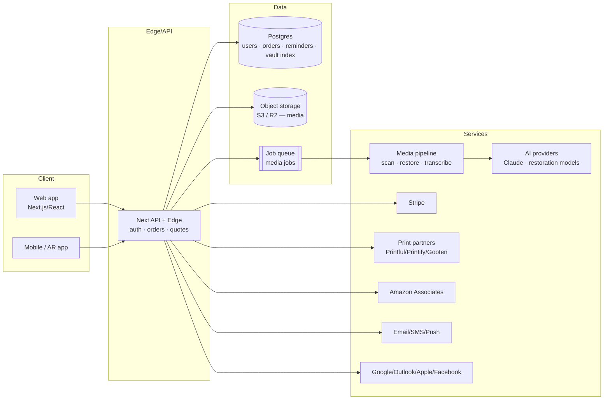

# 🏗️ Architecture — AprilDawn

## Current (this repo)
A **Next.js 16 App Router** application (React 19, TypeScript, Tailwind v4). Pages
are statically generated where possible; interactive bits (uploader, forms) are
client components; backend logic lives in **Route Handlers** under `src/app/api/*`.
Content/data is currently static modules in `src/lib/*`.

```
Browser ──► Next.js (SSR/SSG pages + client components)
                 │
                 ├─ /api/upload     (mint pre-signed URLs — stub)
                 ├─ /api/quote      (instant estimate — stub)
                 ├─ /api/reminders  (create reminder — stub)
                 └─ /api/contact    (lead capture — stub)
```

## Target production architecture



## Components

### Frontend
- **Next.js App Router** for SEO-critical marketing + commerce.
- Server Components by default; Client Components for uploader/forms.
- Tailwind v4 design tokens (`globals.css`).

### Auth & accounts
- Email + social login (NextAuth/Auth.js or Clerk). Sessions via secure cookies.
- Roles: customer, lab operator, admin.

### Storage
- **Object storage** (S3 or Cloudflare R2) for all media. Browser uploads go
  **directly** via short-lived **pre-signed URLs** (the `/api/upload` pattern) so
  large files never proxy through the server. Resumable uploads for big videos.
- **Postgres** for relational data (users, orders, reminders, vault index, jobs).
- CDN for delivery of derived/web copies.

### Media pipeline (async)
- Jobs enqueued on upload/intake; workers run scan-derivative generation,
  restoration, colorization, up-res, and transcription. See `MEDIA-PIPELINE.md`.
- Human-in-the-loop **proof approval** before fulfillment.

### Payments
- **Stripe** for one-off orders and subscriptions (Family Vault, card plans).
- Webhooks reconcile order state.

### Fulfillment
- First-party printing for core SKUs; **POD partners** (Printful/Printify/Gooten)
  for the long tail via their order APIs + webhooks.
- **Amazon Associates** deep links for accessory/affiliate SKUs.

### Notifications
- Transactional email (Resend/SendGrid) + SMS (Twilio) + push.
- Reminder scheduler (cron/queue) drives the occasions engine.

### Integrations
- OAuth to Google/Microsoft/Apple/Facebook for birthdays & calendars (read-limited).
- See `INTEGRATIONS.md` for scopes & webhooks.

## Non-functional
- **Security:** encryption in transit + at rest, least-privilege access, signed URLs,
  secret management via env (`.env.example`). PII/biometric care (face data).
- **Privacy:** export/delete, regional data handling (GDPR/CCPA).
- **Reliability:** queue retries, idempotent webhooks, item-level audit trail for originals.
- **Observability:** structured logs, job dashboards, error tracking.
- **Scalability:** stateless app tier, object storage for media, queue for heavy work.

## Suggested deployment
- App on **Vercel** (or any Node host) + managed **Postgres** + **R2/S3** + a
  queue (e.g., Upstash/SQS) + worker service for the media pipeline.
