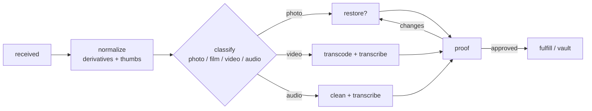

# 🪄 Media Pipeline — AprilDawn

How a memory travels from intake to a finished, vaulted, fulfillable asset.

## Intake

### Upload path
1. Client requests a pre-signed URL from `/api/upload`.
2. Browser uploads directly to object storage (resumable for large video).
3. An `asset` record is created (status `received`) and a job is enqueued.

### Mail-in (MemoryBox) path
1. Customer orders a prepaid, trackable kit.
2. **Lab intake**: every physical item is **photographed and inventoried** (item-level IDs).
3. Items are digitized on calibrated hardware; derivatives enter the same pipeline.
4. Originals are repacked and **returned insured**.

## Processing stages

1. **Normalize** — generate archival master + web/preview derivatives + thumbnails; extract EXIF/dates; optional face/scene tagging for organization.
2. **Classify** — route by media type.
3. **Restore (opt-in)** — AI-assisted, artist-finished: de-scratch, de-noise, tear/water repair, colorize, up-res. Tunable strength.
4. **Transcode & transcribe** — video → clean H.264/H.265 masters + HD/4K up-res; audio cleanup; **AI transcripts + captions** (human-reviewed).
5. **Proof** — customer reviews; requests changes; nothing ships or charges until approved.
6. **Fulfill / vault** — push to print partners and/or store the final in the **Memory Vault**.

## AI usage & guardrails
- Restoration/colorization/up-res use specialized models; **AI motion ("Living Portrait")** and **voice narration** are **opt-in, consent-gated, and clearly labeled**.
- Captions/transcripts and gift suggestions can use the latest **Claude** models (`ANTHROPIC_MODEL`).
- **No AI output auto-ships** — a human-approved proof is mandatory for paid deliverables.

## Quality & safety
- Color-managed scanning (ICC profiles), calibrated targets.
- Item-level chain of custody for physical originals (intake photo → return).
- Content moderation gates (see `LEGAL-COMPLIANCE.md`) run before fulfillment.

## Outputs
- 🗄️ Archival master (lossless/high-bit) + web copies.
- 🧾 Transcripts/captions (`.srt`/`.vtt` + text).
- 🖼️ Print-ready, smart-cropped renders per product.
- 📲 Companion-app assets (Living Wall feed, AR/NFC payloads for Memory Mail).
